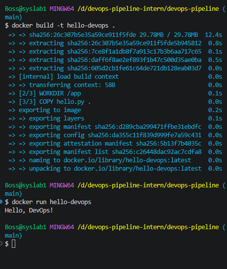
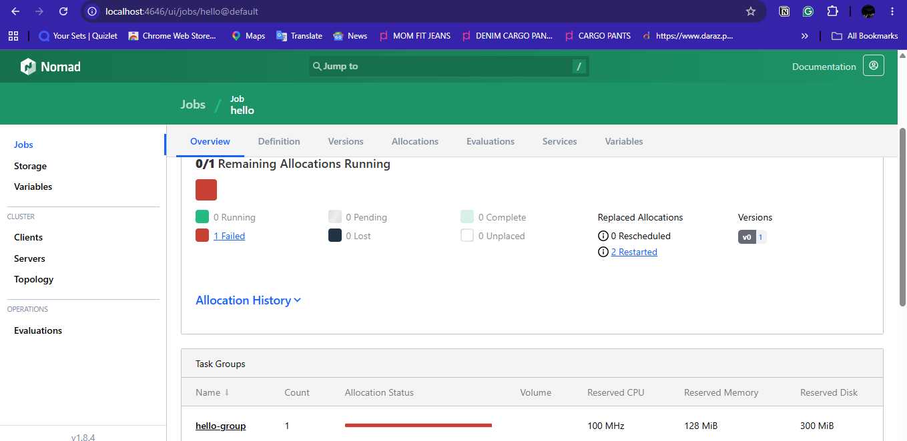
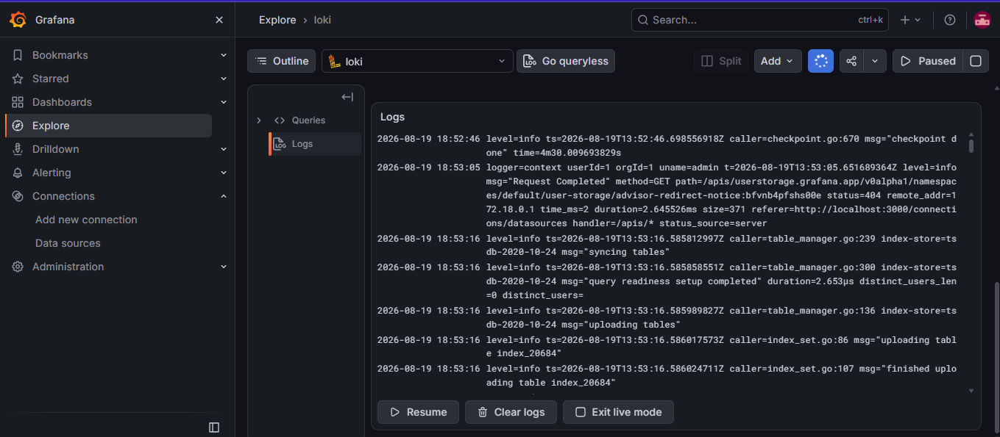
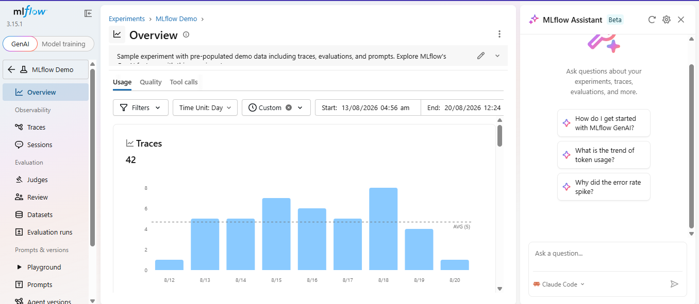

[](https://github.com/malghalara/devops-pipeline/actions/workflows/ci.yml)


# DevOps Pipeline — Intern Final Assessment

**Name:** Malghalara Ahmad
**Date:** 2026-08-19

## Project Description
This repository demonstrates a small end-to-end DevOps pipeline covering Git/GitHub, Linux scripting, Docker, CI/CD with GitHub Actions, Nomad job deployment, monitoring with Grafana Loki, and (optionally) MLflow experiment tracking. Each step builds on the previous one, simulating a small but realistic DevOps workflow using open-source tools.

---

## Step 1: Git & GitHub Setup
A public GitHub repository was created and initialized with this README and a sample script (`hello.py`) that prints `Hello, DevOps!`.

Clone it:
```bash
git clone https://github.com/malghalara/devops-pipeline.git
cd devops-pipeline
```

Run the sample script:
```bash
python hello.py
```

---

## Step 2: Linux & Scripting Basics
`scripts/sysinfo.sh` prints the current user, current date, and disk usage.

Run it:
```bash
chmod +x scripts/sysinfo.sh
./scripts/sysinfo.sh
```

**Sample output:**
```
===== System Info =====
Current user:
Boss

Current date:
Tue, Aug 18, 2026 12:40:51 AM

Disk usage:
Filesystem            Size  Used Avail Use% Mounted on
C:/Program Files/Git  241G  234G  7.3G  98% /
D:                    235G   41G  194G  18% /d
```

---

## Step 3: Docker Basics
`Dockerfile` containerizes `hello.py` so it runs automatically when the container starts.

**Dockerfile:**
```dockerfile
FROM python:3.11-slim
WORKDIR /app
COPY hello.py .
CMD ["python", "hello.py"]
```

Build the image:
```bash
docker build -t hello-devops .
```

Run the container:
```bash
docker run hello-devops
```

**Expected output:**
```
Hello, DevOps!
```



---

## Step 4: CI/CD with GitHub Actions
`.github/workflows/ci.yml` automatically runs `hello.py` on every push to the repository, using a fresh Ubuntu runner with Python 3.11.

```yaml
name: CI

on: [push]

jobs:
  run-hello:
    runs-on: ubuntu-latest
    steps:
      - name: Checkout code
        uses: actions/checkout@v4

      - name: Set up Python
        uses: actions/setup-python@v5
        with:
          python-version: '3.11'

      - name: Run hello.py
        run: python hello.py
```

The CI status badge at the top of this README reflects the live status of the most recent workflow run. View all runs under the **Actions** tab of this repository.

---

## Step 5: Job Deployment with Nomad
`nomad/hello.nomad` defines a Nomad job that runs the `hello-devops` Docker image built in Step 3.

```hcl
job "hello" {
  datacenters = ["dc1"]
  type        = "batch"

  group "hello-group" {
    count = 1

    task "hello-task" {
      driver = "docker"

      config {
        image      = "local/hello-devops:latest"
        force_pull = false
      }

      resources {
        cpu    = 100
        memory = 128
      }
    }
  }
}
```

**Note on job type:** `type = "batch"` is used instead of `service`, since `hello.py` is a short-lived script that prints once and exits — this matches Nomad's batch scheduling semantics rather than a long-running service.

Run it:
```bash
nomad agent -dev
```
In a separate terminal:
```bash
nomad job run nomad/hello.nomad
nomad job status hello
```
View the job in the Nomad Web UI: http://localhost:4646


---

## Step 6: Monitoring with Grafana Loki
Loki collects logs, Promtail forwards Docker container logs to Loki, and Grafana visualizes them.

**Start Loki:**
```bash
docker run -d --name=loki -p 3100:3100 grafana/loki:latest
```

**Set up networking and forward logs with Promtail:**
```bash
docker network create loki-net
docker network connect loki-net loki
docker run -d --name=promtail --network=loki-net \
  -v /var/run/docker.sock:/var/run/docker.sock \
  -v "$(pwd)/monitoring/promtail-config.yaml":/etc/promtail/config.yaml \
  grafana/promtail:latest -config.file=/etc/promtail/config.yaml
```

**Start Grafana:**
```bash
docker run -d --name=grafana --network=loki-net -p 3000:3000 grafana/grafana:latest
```

**View logs:**
1. Open http://localhost:3000 (login: `admin` / `admin`)
2. Add a data source: **Connections → Data sources → Add data source → Loki**, URL: `http://loki:3100`
3. Go to **Explore**, select the Loki data source, and run the query:
   ```
   {container=~".+"}
   ```

Full setup notes: [`monitoring/loki_setup.txt`](monitoring/loki_setup.txt)
Promtail config: [`monitoring/promtail-config.yaml`](monitoring/promtail-config.yaml)



---

## Step 7 (Extra Credit): MLflow Tracking
A dummy experiment is logged using MLflow to demonstrate experiment tracking.

`mlflow/dummy_experiment.py`:
```python
import mlflow

with mlflow.start_run():
    mlflow.log_param("learning_rate", 0.01)
    mlflow.log_metric("accuracy", 0.92)
    print("Logged dummy MLflow experiment.")
```

Run it:
```bash
pip install mlflow
python mlflow/dummy_experiment.py
mlflow ui
```
Then open http://localhost:5000 to view the logged run (`learning_rate`, `accuracy`).



---

## Repository Structure

```
devops-pipeline/
├── README.md
├── hello.py
├── Dockerfile
├── scripts/
│   └── sysinfo.sh
├── .github/
│   └── workflows/
│       └── ci.yml
├── nomad/
│   └── hello.nomad
├── monitoring/
│   ├── loki_setup.txt
│   └── promtail-config.yaml
├── screenshots/
│   ├── docker-run.png
│   ├── nomad-ui.png
│   └── grafana-loki.png
└── mlflow/
    ├── dummy_experiment.py
    └── (mlruns/ generated locally, not tracked in git — see .gitignore)
```

## Tools Used
- Git & GitHub
- Bash / Linux command line
- Docker & Docker Desktop
- GitHub Actions (CI/CD)
- HashiCorp Nomad
- Grafana Loki, Promtail, Grafana
- MLflow